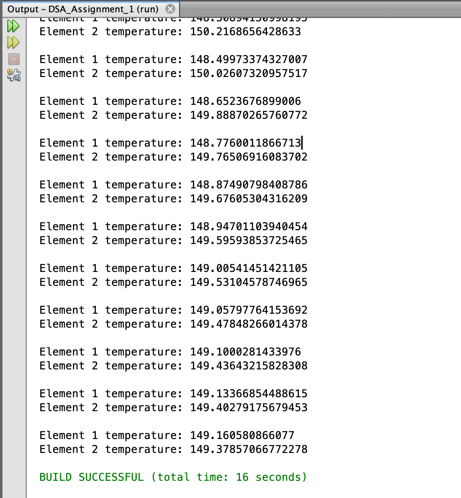
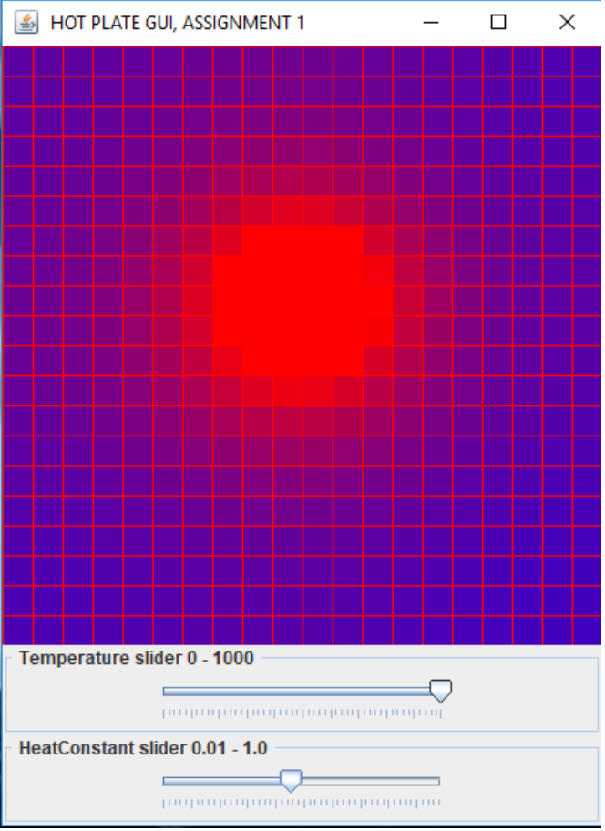

# Hotplate

## Overview
The class Element represents a single unit that can be part of multiple elements forming a grid hotplate. Elements in the hotplate run in their own thread to heat and cool when temperatures are applied. All Element instances share a static field value called heatConstant, which is what the element temperature change will be incremented by. The class keeps track of which other elements it is horizontally or vertically connected to in a List called neighbours. A neighbouring element should be able to be added to the list via an addNeighbour method. The start method should start running an Element instance in its own individual thread. While running, each element should be able to compare the average temperatures of its neighbours (above, below, left and right) with its own temperature and adjusts its current temperature before sleeping for a small period of time. This should mean that if an individual element unit is clicked on the Hotplate (e.g. from a completely cold Hotplate, being clicked to heat it), the surrounding elements should also follow and eventually match the temperature of the element that was clicked.

#### Element
To test this a main method in a test class has been created, creating two Element objects. The first element temperature will be set at 300, and the second element will be set at 0. Using an appropriate heat constant, each element thread should be started and should periodically print out temperatures which will eventually reach an approximately equal temperature. 

 

#### HotplateGUI
To represent the hotplate a GUI has been created that holds a central panel with a grid representing each Element object as a 2D array. Each element has four neighbours to get temperature information from, causing a gradient effect of temperature change. When an element unit is clicked, the GUI should repaint the panel with all the Element objects, starting with the element units neighbours.

  

#### LinkedRRSet
The LinkedRRSet class is a subclass of a given LinkedSet class. It should override the existing add method of LinkedSet to put elements in a natural order with no duplicates. 

##### Note:
This is a repository containing the Hotplate project completed by Grace Subianto in 2019 for the Data Structures and Algorithms paper at the Auckland University of Technology. This is not the complete project files, and the project was incomplete in functionality when handed in as an assignment.
