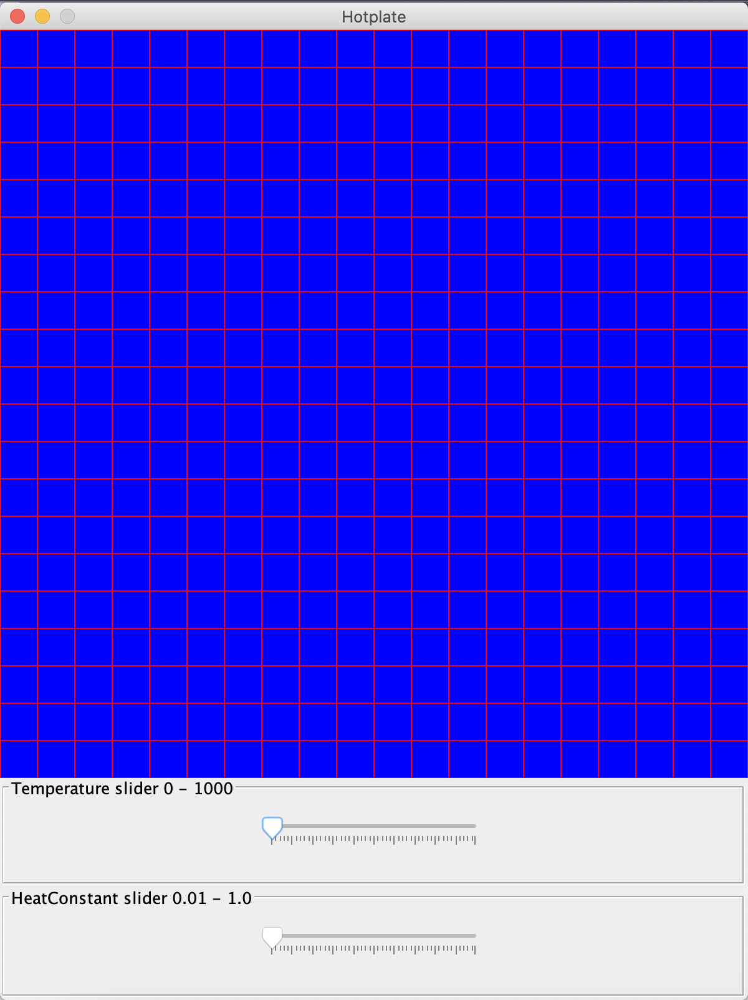
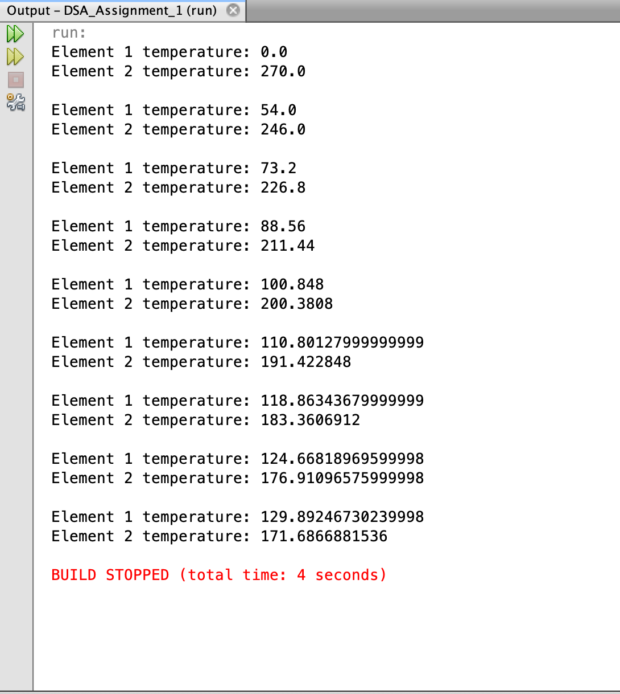
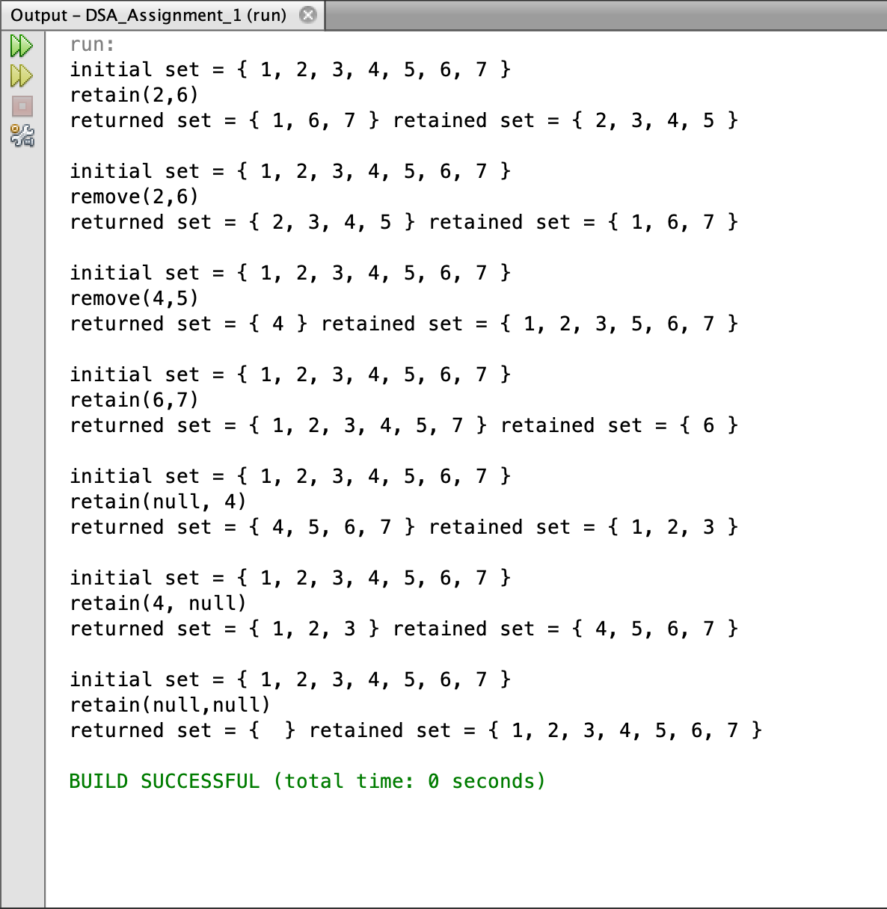

# Hotplate

###### HotplateGUI
 

###### Element Output

###### LinkedRRSet Output

## Overview
This is a repository containing a project completed in 2019 for the Data Structures and Algorithms paper at the Auckland University of Technology. 

The class *Element* is a single entity that can be part of multiple elements forming a grid hotplate. Elements in the hotplate must run in their own thread to heat and cool when temperatures are applied. All *Element* instances share a static field value called *heatConstant*, which is what the element temperature change will be incremented by. The class should keep track of which other elements it is horizintally or vertically connected to in a *List* called neighbours. A neighbouring element should be able to be added to the list via an *addNeighbour* method. The *start* method should start running an *Element* instance in its own individual thread. While running, each element should be able to compare the average temperatures of its neighbours with its own temperature and adjusts its current temperature. This should mean that if an individual element is clicked on the Hotplate (e.g. from a completely cold Hotplate, being clicked to heat it), the surrounding elements should also follow and evetually match the element that was clicked.

